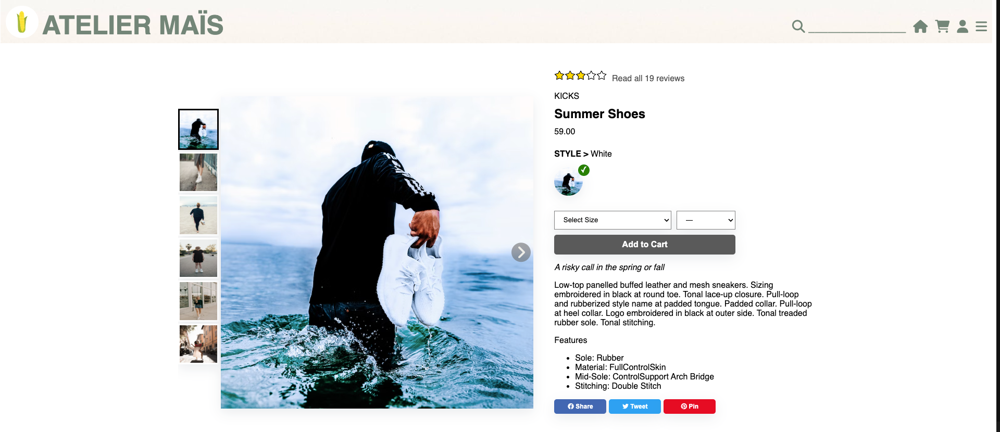
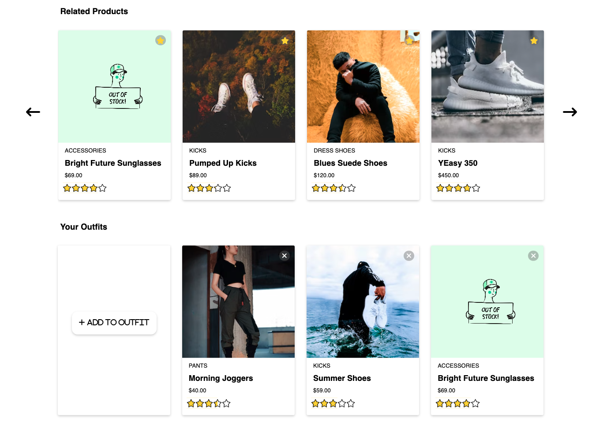
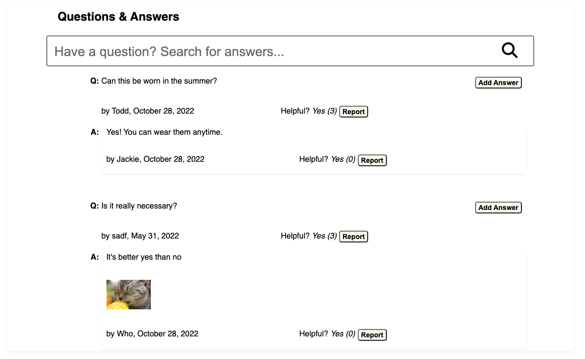
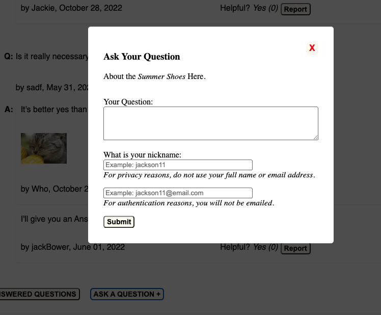
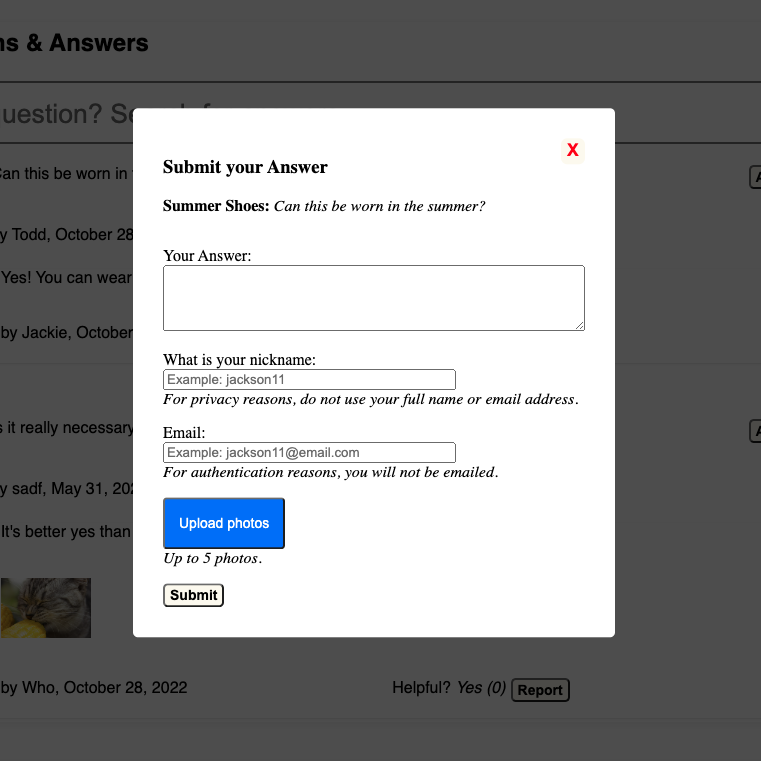
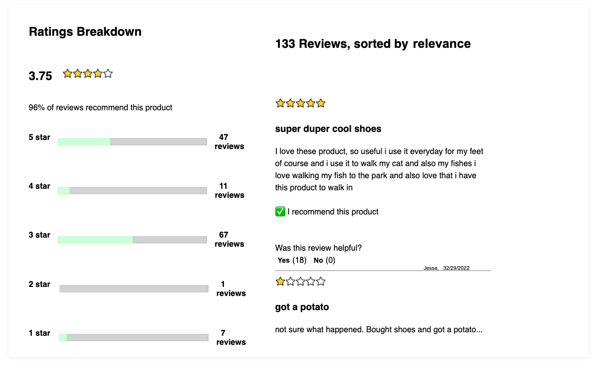

# FEC-Project-Atelier

### Contributors
<a href="https://github.com/stephaaniechen">Stephanie Chen</a>,
<a href="https://github.com/joshgarza">Josh Garza</a>,
<a href="https://github.com/hieungo89">Hieu Ngo</a>,
<a href="https://github.com/scottmatsuda">Scott Matsuda</a>
 

<!-- ABOUT THE PROJECT -->
## About the Project
This project was completed over a 3-week sprint. Following the Business Requirements Document, our team created a client-facing retail web-portal template with the provided API.

### This project includes the following sections:
1. Overview
2. Related Products
3. Questions and Answers
4. Ratings and Reviews

(<a href="#top">back to top</a>)

## App Features
### Product Overview:

  

The product overview includes an image gallery for the selected product, product description, price and ratings. The user can select from different styles, sizes and quantities to add to cart. Sale prices are shown in red next to the original.
<table>
  <tr>
    <td>
      
    </td>
    <td>
      <b>Expanded View:</b>  When a user zooms into the image, the image gallery expands to the width of their screen to enable a closer look.
    </td>
  </tr>
</table>

(<a href="#top">back to top</a>)

### Related Products:

  

Users can scroll through the related products carousel to see suggested products. Each related product card contains the name, image, price, and rating for the product.
<table>
  <tr>
    <td>
      
    </td>
    <td>
      <b>Compare Products:</b>  A user can click on the card of a related product to compare its features with the current product. A modal popup allows a user to compare without leaving the page.
    </td>
  </tr>
</table>

(<a href="#top">back to top</a>)

### Questions and Answers:

  

Questions and answers related to the product are shown in this section. Only 2 sets of questions and answers are shown by default, but users can click expand to see additional questions and answers. Users can post their own questions and answers. They can also mark specific questions and answers as helpful. Marking as helpful will move it toward the top of the list, allowing other users to locate helpful data more easily. Users can also report questions and answers to remove them from the list. Users can search for specific question or answer with the search bar.
<table>
  <tr>
    <td>
      
    </td>
    <td>
      <b>Search Bar:</b> This feature allows user to look up questions and answers based on at least 3 keywords typed. The search is not case sensitive.
    </td>
  </tr>
  <tr>
    <td>
      
    </td>
    <td>
      <b>Add Questions:</b> Clicking on "ASK A QUESTION +" button will open a modal that allows the user to fill in their question. The user must fill out the question box, their name, and a valid email address in order to press the submit button.
    </td>
  </tr>
  <tr>
    <td>
      
    </td>
    <td>
      <b>Add Answer:</b> Clicking on "ADD ANSWER" button will open a modal that allows the user to write an answer to the given question. The user must fill out the answer box, their name, and a valid email address in order to press the submit button. The user has the option to upload up to 5 photos. Uploading photos uses an outside source called Cloudinary to render the images as a url.
    </td>
  </tr>
</table>

(<a href="#top">back to top</a>)

### Ratings and Reviews:

  

Users can see how other customers have rated the product from a scale of 1-5. An average of all scores is shown, as well as the breakdown by rating. The stars correspond with the average rating. Up to 4 reviews is shown by default but users can click to see more. Users can also add their own rating and reviews for the product. Like questions and answers, users can also mark reviews as helpful to increase visibility or report to remove them.
<table>
  <tr>
    <td>
      
    </td>
    <td>
      <b>Write Reviews:</b>  A modal popup allows a user to add a review for the selected product without leaving the page.
    </td>
  </tr>
</table>

(<a href="#top">back to top</a>)

### Built with:
* [React.js](https://reactjs.org/)
* [Express.js](https://expressjs.com/)
* [React Testing Library](https://testing-library.com/)

(<a href="#top">back to top</a>)

## Getting Started:
  1. Install Dependencies: `npm install`

  2. Make a copy of `example.env` and rename to `.env`

  3. Create a .gitignore file and place in:
    -node_modules
    -client/dist
    -.env

  4. `npm run server-dev`

  5. `npm run client-dev`:
    -listens on PORT set in `.env` or 3000

  6. Launch site: http://localhost:3000

(<a href="#top">back to top</a>)
